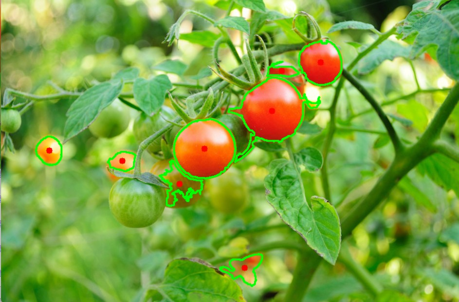

# My First Dip into OpenCV: Automatic Tomato Detector 🍅

I've always been fascinated by the "magic" of Computer Vision, so I decided to take the plunge and signed up for an OpenCV course at Chung Yuan Christian University (CYCU). Truth be told, the commute was brutal. I had to leave at 7 AM every Saturday, take a train from Taipei to Zhongli, and then ride a YouBike to the campus. I’ll never forget the first class coinciding with the school anniversary—I got stuck in traffic for an hour waiting for the shuttle bus just to get back to the train station!

This "Tomato Detector" was a mini-project I built during that course. The instructor’s motivation was simple: Can we write a program that lets the computer "see" and count the tomatoes in a photo, so we don't have to do it with our naked eyes?

So, I tried my hand at OpenCV to handle the image detection. In the end, I actually succeeded in teaching the computer how to count the tomatoes and locate their centers.

## What can this little program do?

In most cases, the biggest enemy of image processing is noise. So, this project wasn't just about "finding things"; I spent a lot of time teaching the program how to "see" the world properly:

**1. Auto-Targeting:** Whether it's a tomato or another round object, the program attempts to lock onto it and draw a circle around it.

**2. Noise Filtering:** Photos often have dirt spots or lighting artifacts. I implemented a mechanism to automatically ignore specks that are too small to be relevant.

**3. Automated Counting:** It acts as a tally counter, telling me exactly how many qualified products are in the frame, saving manual effort. I’m currently thinking about how to apply this to my work in the **Offshore Wind Industry**. If we can standardize markings on defective electromechanical parts and let a computer identify them automatically, it would be a huge help for QA/QC inspections! (Definitely something to try in the future).

## Technical Details

Since I already had a background in **Python**, the learning curve felt manageable. The core logic is built with Python, while the heavy lifting for image processing is done by **OpenCV (cv2)**.

To improve object recognition accuracy, I skipped the standard RGB and switched to the **HSV Color Space**, which is often more reliable for isolating specific colors. I then used **Canny Edge Detection** to outline shapes and applied **Morphological Operations (Erode)** to refine the contours and separate lines that were sticking together. The mathematical calculations were handled by **NumPy**.

## Results

Here is the execution result. As you can see, the tomatoes have been successfully detected and boxed!

## Want to try it out?

1. First, run this line to set up your environment:
`pip install -r requirements.txt`

2. Then, simply run the main program:
`python main.py`

*I rebuilt this project after the course mainly to test my own understanding of OpenCV image processing. Looking back, I know it’s a very beginner-level project haha, but the moment I saw the computer correctly circle those tomatoes, the sense of accomplishment was amazing. It definitely gave me the motivation to try building more complex projects.*

# OpenCV 初體驗---自動番茄檢測器

說起來，電腦視覺這塊領域，一直都讓我覺得挺神奇的，我也非常有興趣，所以毅然決然去上了在中原大學的OpenCV課。老實說真的超遠的，禮拜六還要早上7點出門，從台北搭火車到中壢，再騎YouBike到中原。永遠不會忘記第一堂課剛好遇到校慶，回程待接駁車一路塞了1個小時才回到火車站。

而這個"Tomato Detector"是我在課程中的一個小作品。老師說當時的想放進課程的原因很簡單：能不能讓我們自己寫個程式，能讓電腦自己去看照片裡的番茄，而不是我們用肉眼去數？

於是我試著用 OpenCV 搞定影像偵測，讓電腦幫我"挑土豆"，最後還真的成功讓它學會了怎麼算出番茄的數量和中心位置。

## 這個小程式能做什麼？

在多數情況下，我們處理照片最怕的就是雜訊干擾。所以這個專案不只是單純的"找東西"，我還花了不少心思在學習如何調整它怎麼看世界：

**1.自動鎖定目標**：不管照片裡是番茄還是其他圓滾滾的東西，程式都會嘗試把它們圈出來。

**2.過濾掉不需要的雜訊**：照片裡難免有些髒點或光影瑕疵，我設定了一個機制，讓程式自動忽略那些太小的點。

**3.充當計數員**：它能直接幫我算好畫面裡到底有幾個合格的產品，省得人工去點算。對我現在所在的離岸風電產業來說，針對一些機電設備或是零件，若是能統一在不合格品上做記號，再讓電腦自動辨識，肯定能幫QA/QC一個大忙!(之後來試試)

## 技術細節

因為有學習過Python，其實學起來感覺並不複雜。主力是 **Python**，而影像處理交給 **OpenCV (cv2)**。

為了讓電腦更準確地辨識物體，我沒用常見的 RGB，而是轉用了 **HSV 色彩空間**，這在抓取特定顏色時往往更可靠。接著配合 **Canny 邊緣檢測**來勾勒形狀，再用**形態學運算 (Erode)** 來修整輪廓，把黏在一起的線條分開。數學運算就是 **NumPy** 的工作。

## 執行結果

這是我的執行結果，可以看到番茄被成功框選出來了!

## 心動了想玩玩看的話

1. 先跑這一行指令，幫你完成環境：
`pip install -r requirements.txt`
2. 然後直接跑主程式：
`python main.py`

*課程後自己做看看這個專案，主要是想考考自己對 OpenCV 影像處理的理解程度。自己看也覺得很初學者的作品哈哈哈，但看著電腦能正確圈出番茄的那一刻，那種成就感真棒，我也更有動力是看看其他作品了。*
